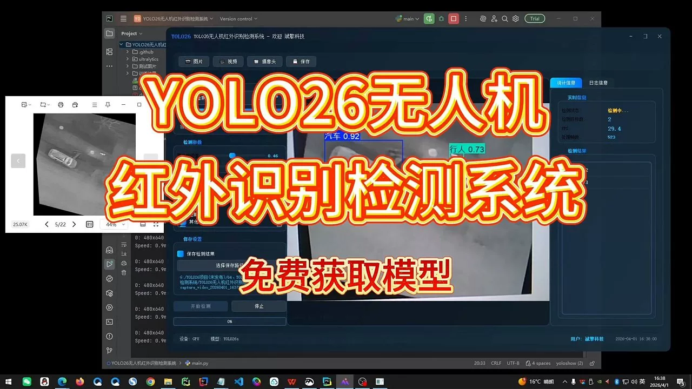
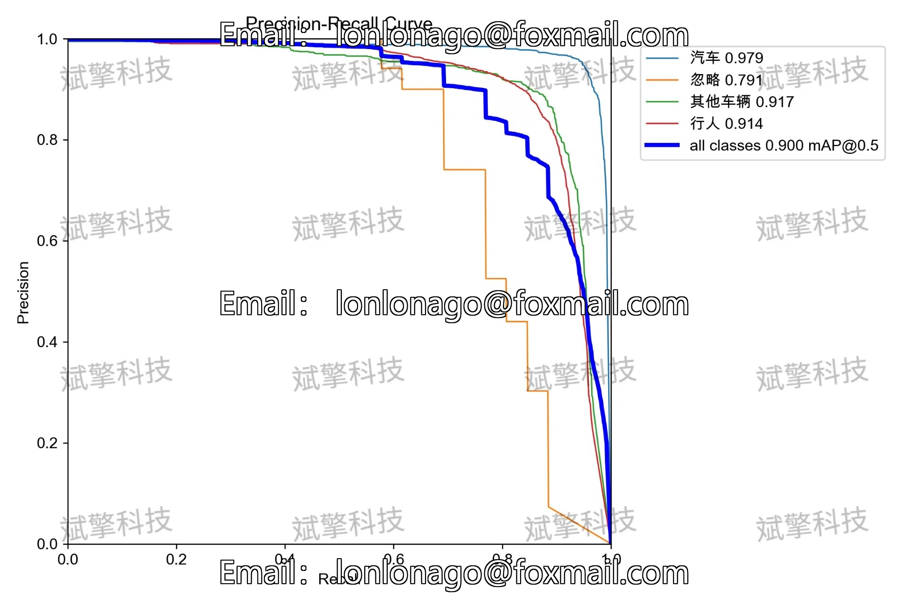
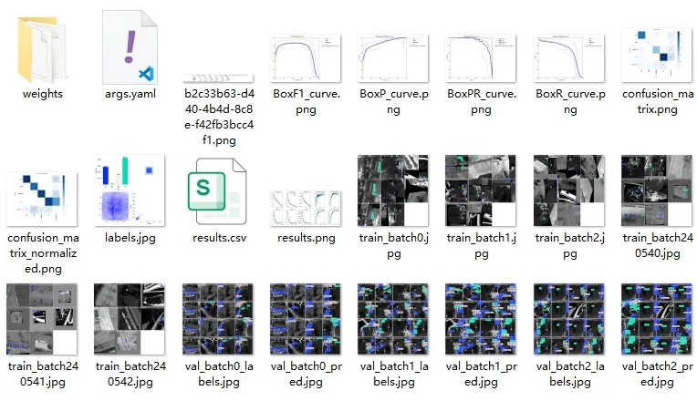
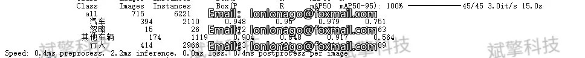
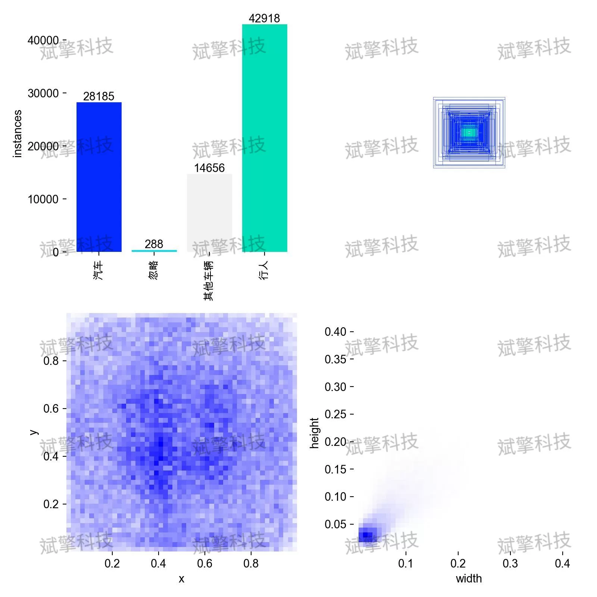
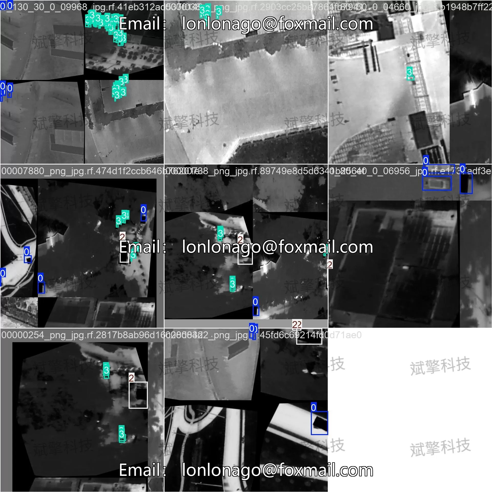
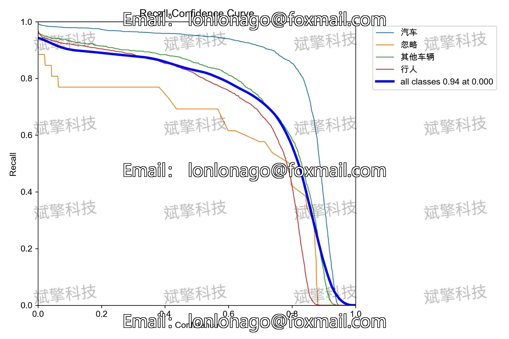
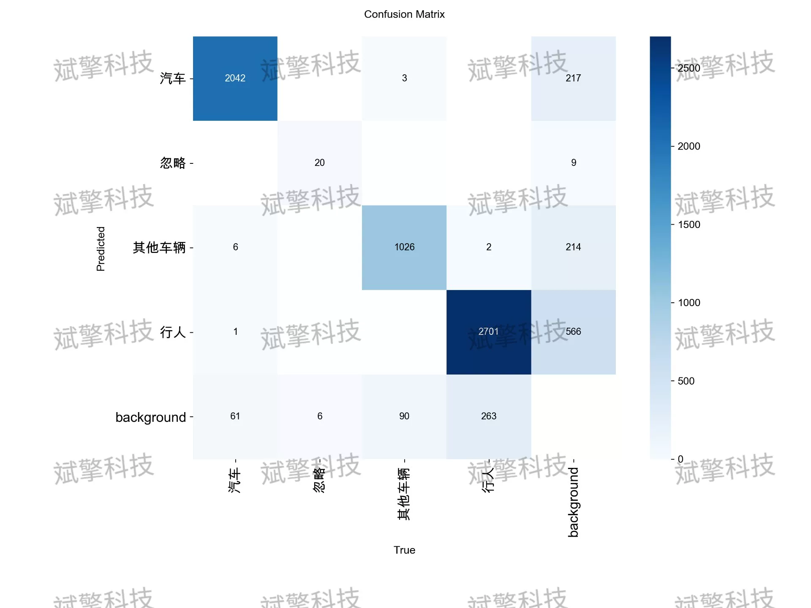
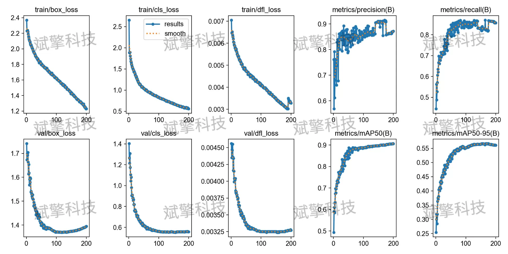

# YOLO26 Drone Infrared Recognition Detection System | Source Code

## Body

YOLO26 drone infrared recognition detection system | Source code YOLO26 infrared target detection breakthrough! Drone perspective mAP@0.5 up to 90.0%, car category accuracy 0.979

This article focuses on the task of target detection under the drone's infrared perspective, constructing and evaluating a deep learning detection system based on the YOLO26 architecture. The research aims to address issues such as blurred target features in infrared images, complex backgrounds, and difficulties in detecting small targets. The experiment used an infrared dataset containing four categories: "car", "ignored area", "other vehicles", and "pedestrians", totaling 11,198 images. The training results show that the model achieved an excellent mAP@0.5 of 0.900 on the validation set. Among them, the detection accuracy for "car" category reached 0.979, and "pedestrians" and "other vehicles" also performed stably. The overall system demonstrated high real-time performance and robustness, proving the effectiveness and application potential of the YOLO26 architecture in the field of drone infrared reconnaissance and monitoring.

The dataset contains four categories, specifically defined as follows:
Car: Includes common passenger cars, SUVs, and other small passenger vehicles.
DontCare: Marked as "ignored" areas. Typically refers to targets that are too far away, have very small imaging, or are obscured severely to be difficult to identify. In training and evaluation, such targets are not included in the positive sample penalty, but special handling is required during inference to reduce false alarms.
OtherVehicle: Other than cars, including trucks, buses, construction vehicles, etc., usually larger in size with richer heat source characteristics.
Person: Pedestrian targets, one of the most challenging categories in infrared detection, due to its thermal characteristics easily affected by clothing and environmental temperature.

Training set: 10,128 images
Validation set: 715 images
Test set: 355 images

Free reservation for remote installation. Unsuccessful full refund.
Purchase enjoy the following resources (百度网盘自动解锁)
   - YOLO recognition detection project complete source code
   - YOLO format datasets
   - Training code + UI interface code
   - Trained model + result images
   - Software installation package
   - Add WeChat reservation for remote installation (purchase automatically shows WeChat ID) - Unsuccessful, full refund

## Images

## Payment

Here is a pay link on Stripe ( https://buy.stripe.com/3cs8yP7sY87d0vu9AB ). Please contact me lonlonago@foxmail.com after funding $89, and I will send you a complete data files , thank you!

